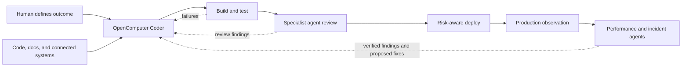

# OpenComputer Coder

A reusable OpenComputer template for a long-running coding agent. It works in
the GitHub repositories selected during installation, retains concise project
context across sessions, opens draft pull requests, and can verify branches
through repository-owned Development or preview workflows.

[Create this project in OpenComputer](https://app.opencomputer.dev/new?repository-url=https%3A%2F%2Fgithub.com%2Fdiggerhq%2Fopencomputer-native-coder)

The implementation is intentionally native and small. OpenComputer supplies
the coding harness, durable computer and sessions, short-lived GitHub
credentials, and optional Slack routing. This project does not add a custom
receiver, queue, GitHub wrapper, agent loop, or deployment credential.

## The OpenComputer agent series

OpenComputer Coder is the first in a series of reusable agent templates for an
agentic software factory. The series adapts the pattern shown for OpenAI's
internal engineering workflow into components that teams can install, inspect,
and operate on OpenComputer. It does not assume that every team has the same
repositories, infrastructure, review policy, or production controls.

The goal is not one all-powerful agent. Each template owns a clear part of the
software lifecycle and receives only the tools and authority that part needs:



This repository ships the first component: the coder that turns a bounded
outcome into a tested branch and draft pull request, then verifies it through a
safe repository-owned preview workflow when one exists. The broader series
will cover build and test orchestration, parallel specialist review, risk-aware
deployment, production observation, performance regression work, and incident
response. Those later components should remain separately installable and
composable rather than silently expanding the coder's permissions.

## What the template creates

- one `coder` agent using the built-in shell;
- a managed GitHub App connection scoped by the repositories you select;
- policy for changes, draft pull requests, non-production deployments,
  smoke checks, iteration, and evidence-based reporting.

Repository selection is the hard access boundary. The agent discovers project
structure and operating rules from each repository's `AGENTS.md`, README,
workflows, and current Git/GitHub state. Nothing in this template is tied to a
specific organization or target repository.

## Install as a template

Open the link above, choose a project name, and connect GitHub. Select only the
repositories this agent should be able to change. The App may write repository
contents and pull requests, read checks, and dispatch GitHub Actions, so keep
the selection narrow.

After installation, OpenComputer opens the Coder's Debug playground and runs a
read-only setup check. The first run verifies GitHub access and reports the
repositories available to the project without cloning, changing, pushing, or
deploying anything.

## Develop and validate the template

Prerequisite: Node.js 22 or later.

```bash
npm install
npm run check
npm run template:validate
npm run template:build
```

`doctor` and the template checks are local and side-effect-free. To work on a
project created from the template, link that checkout to its Development
project and deploy normally:

```bash
npm run opencomputer -- login
npm run opencomputer -- link --project <project-id-or-slug>
npm run deploy
npm run opencomputer -- github connect --environment development
```

The one-shot deploy advances Development and exits. No local process needs to
remain running.

## Deployment verification contract

The agent can close the loop only when a target repository already provides a
GitHub Actions workflow for an explicitly named Development or preview target.
That workflow should:

- name Development or preview in both its UI and configuration;
- be unable to select a Production environment or Production configuration;
- accept an exact branch or immutable commit;
- emit the deployment URL and run a bounded smoke or health check; and
- use environment protection and narrowly scoped deployment credentials.

The agent inspects that contract before dispatch, observes the workflow run,
records the URL, runs the repository-owned verification, and can fix its branch
and repeat. If the contract or required credentials are missing, it reports
the missing capability instead of gaining direct provider access.

## Try it

Start read-only:

> Inspect the connected repository, read all applicable agent instructions,
> identify its default branch and verification commands, and report a concise
> setup summary. Do not change files.

Then request a bounded change:

> Fix the selected issue on a new branch, add focused tests, run the relevant
> checks, and open a draft PR. If the repository has an explicitly
> non-production deployment workflow, deploy this exact branch there, run its
> smoke check, and improve the branch until it passes. Do not deploy Production
> or merge.

## Security boundary

- GitHub repository selection limits which repositories are reachable.
- The agent may execute repository code in its isolated computer; treat it as
  untrusted.
- Deployment credentials remain in repository-owned automation environments
  and never enter the agent computer.
- The agent never deploys or mutates Production without a separately named and
  explicitly authorized target.
- Slack identity is not automatically mapped to GitHub ACLs. Restrict who can
  invoke the bot through channel membership and the GitHub installation scope.
