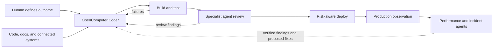

# OpenComputer Coder and Verifier

A reusable OpenComputer template for two focused agents: a coder that builds
changes and a verifier that independently checks pull-request claims. They
work only in the GitHub repositories selected during installation.

[Create this project in OpenComputer](https://app.opencomputer.dev/new?repository-url=https%3A%2F%2Fgithub.com%2Fdiggerhq%2Fopencomputer-native-coder)

The implementation is intentionally native and small. OpenComputer supplies
the coding harness, durable computer and sessions, short-lived GitHub
credentials, and optional Slack routing. This project does not add a custom
receiver, queue, GitHub wrapper, agent loop, or deployment credential.

## The OpenComputer agent series

OpenComputer Coder is the first in a series of reusable agent templates for an
agentic software factory. The series adapts the pattern shown for OpenAI's
internal engineering workflow into components that teams can install, inspect,
and operate on OpenComputer. It does not assume that every team has the same
repositories, infrastructure, review policy, or production controls.

The goal is not one all-powerful agent. Each template owns a clear part of the
software lifecycle and receives only the tools and authority that part needs:



This repository ships the first two components. The coder turns a bounded
outcome into a tested branch and draft pull request. The verifier takes that
pull request, derives a claim-by-claim verification plan, runs repository-owned
checks, exercises browser-visible behavior when the repository provides a
browser specification, and returns evidence. The broader series will cover
parallel specialist review, risk-aware deployment, production observation,
performance regression work, and incident response. Those later components
should remain separately installable and composable rather than silently
expanding either agent's role.

## What the template creates

- one `coder` agent using the built-in shell;
- one read-only-by-default `verifier` agent using the same isolated computer
  and repository boundary;
- a managed GitHub App connection scoped by the repositories you select;
- policy for changes, draft pull requests, local browser checks, optional
  non-production previews, and evidence-based reporting; and
- a small application under `demo-app/` with a Playwright test and a checked-in
  verification contract.

Repository selection is the hard access boundary. The agent discovers project
structure and operating rules from each repository's `AGENTS.md`, README,
workflows, and current Git/GitHub state. Nothing in this template is tied to a
specific organization or target repository.

## Install as a template

Open the link above, choose a project name, and connect GitHub. Select only the
repositories this agent should be able to change. The App may write repository
contents and pull requests, read checks, and dispatch GitHub Actions, so keep
the selection narrow.

After installation, OpenComputer opens the Coder's Debug playground with a
short welcome. It points you to the Connections tab to connect GitHub and
select the repositories the agent may access, then asks you to start a new
session with your first coding task. This welcome does not call any tools.

Use the project agent selector to switch from `coder` to `verifier`. The first
verifier slice is intentionally started by a person with a pull-request URL or
number. A future GitHub label or webhook may create that same session
automatically; the verification behavior does not depend on the trigger.

## Develop and validate the template

Prerequisite: Node.js 22 or later.

```bash
npm install
npm run check
npm run template:validate
npm run template:build
```

`doctor` and the template checks are local and side-effect-free. To work on a
project created from the template, link that checkout to its Development
project and deploy normally:

```bash
npm run opencomputer -- login
npm run opencomputer -- link --project <project-id-or-slug>
npm run deploy
npm run opencomputer -- github connect --environment development
```

The one-shot deploy advances Development and exits. No local process needs to
remain running.

## Deployment verification contract

The agent can close the loop only when a target repository already provides a
GitHub Actions workflow for an explicitly named Development or preview target.
That workflow should:

- name Development or preview in both its UI and configuration;
- be unable to select a Production environment or Production configuration;
- accept an exact branch or immutable commit;
- emit the deployment URL and run a bounded smoke or health check; and
- use environment protection and narrowly scoped deployment credentials.

The agent inspects that contract before dispatch, observes the workflow run,
records the URL, runs the repository-owned verification, and can fix its branch
and repeat. If the contract or required credentials are missing, it reports
the missing capability instead of gaining direct provider access.

## Browser verification

The verifier does not need a separately hosted browser service. A target
repository can own a Playwright, Cypress, or equivalent headless-browser suite
beside its application. The verifier installs locked dependencies inside its
isolated computer, starts the application on localhost through the checked-in
runner, executes the browser suite, and retains repository-declared screenshots
or traces as evidence.

`demo-app/VERIFICATION.md` is a complete small example. Its Playwright runner
starts a static Node application, checks an interactive state transition, and
writes `demo-app/artifacts/verifier-demo-ready.png`. Browser and Linux-library
installation is an explicit, OS-aware repository setup step. Chromium is kept
inside the persistent workspace rather than the runtime's disposable user
cache. A dependency failure is reported as setup, not misclassified as a
product regression.

## Try it

Start read-only:

> Inspect the connected repository, read all applicable agent instructions,
> identify its default branch and verification commands, and report a concise
> setup summary. Do not change files.

Then request a bounded change:

> Fix the selected issue on a new branch, add focused tests, run the relevant
> checks, and open a draft PR. If the repository has an explicitly
> non-production deployment workflow, deploy this exact branch there, run its
> smoke check, and improve the branch until it passes. Do not deploy Production
> or merge.

To try the verifier against a pull request:

> Verify pull request `<URL or number>`. Read its description and every
> applicable repository instruction, then follow `VERIFICATION.md`. Run local
> checks and browser verification, but do not modify the branch, comment,
> approve, merge, or deploy Production. Return a claim-by-claim verdict with
> commands, exit statuses, screenshots or traces, CI state, and uncovered
> risks.

To demonstrate the browser loop against this repository, open a pull request
that changes `demo-app/` and ask the verifier to follow
`demo-app/VERIFICATION.md`.

## Security boundary

- GitHub repository selection limits which repositories are reachable.
- Both agents may execute repository code in an isolated computer; treat that
  code and its dependencies as untrusted.
- The verifier requests read access to contents, pull requests, and checks. It
  requests Actions dispatch authority only for an explicitly requested,
  repository-owned non-production preview workflow; it cannot write code or
  pull-request state with its GitHub token.
- Deployment credentials remain in repository-owned automation environments
  and never enter the agent computer.
- The agent never deploys or mutates Production without a separately named and
  explicitly authorized target.
- Slack identity is not automatically mapped to GitHub ACLs. Restrict who can
  invoke the bot through channel membership and the GitHub installation scope.
